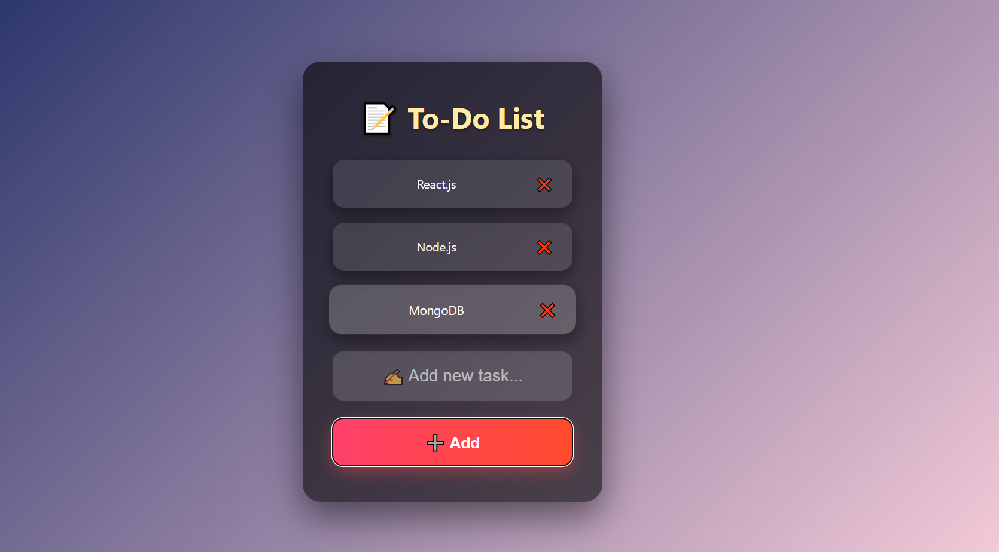

# 📝 Modern To-Do List (React)

A simple and modern To-Do List built with **React.js** and custom **CSS styling**. It helps users manage their daily tasks in a clean and responsive interface.

## 🚀 Features

- Add and remove tasks
- Mark tasks as done (with strikethrough)
- Beautiful modern UI
- Smooth animations and hover effects

## 🔗 Live Demo

[Click here to view the project](https://todo-list-six-steel.vercel.app/
)  

## 🧑‍💻 Tech Used

- React.js (useState & useRef)
- CSS (modern styles & transitions)

## 📸 Screenshot

  
